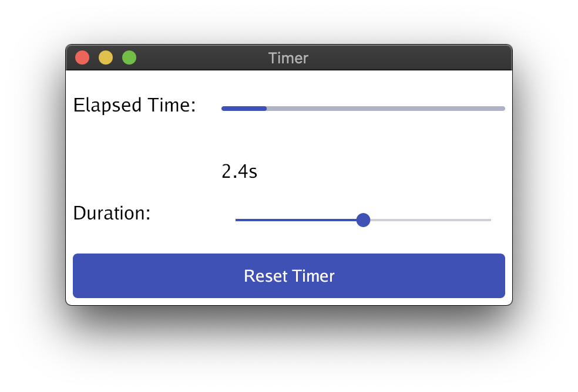
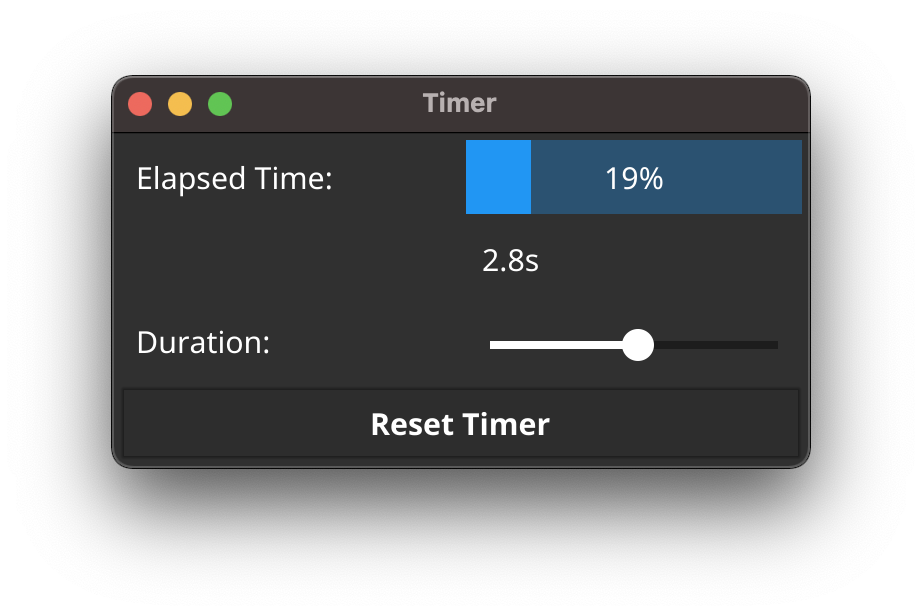

# 7GUIs using Go

An implementation of the [7 GUIs challenges](https://eugenkiss.github.io/7guis/) with Go.

- [Gio](https://gioui.org/)
- [Fyne](https://fyne.io)

## Counter

Challenge: Understanding the basic ideas of a language/toolkit.

  
  

## Temperature Converter

Challenges: bidirectional data flow, user-provided text input.

  
  

## Timer

Challenges: concurrency, competing user/signal interactions, responsiveness.

  
  

