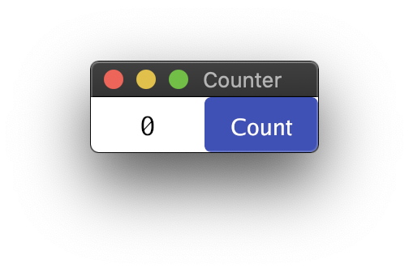
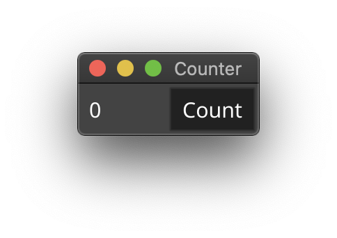
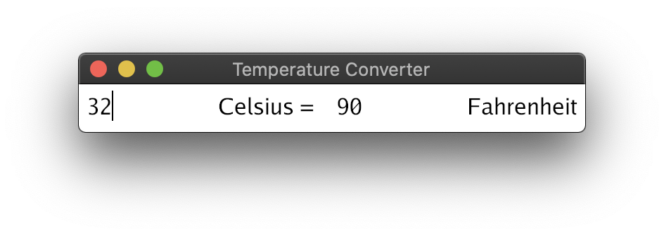
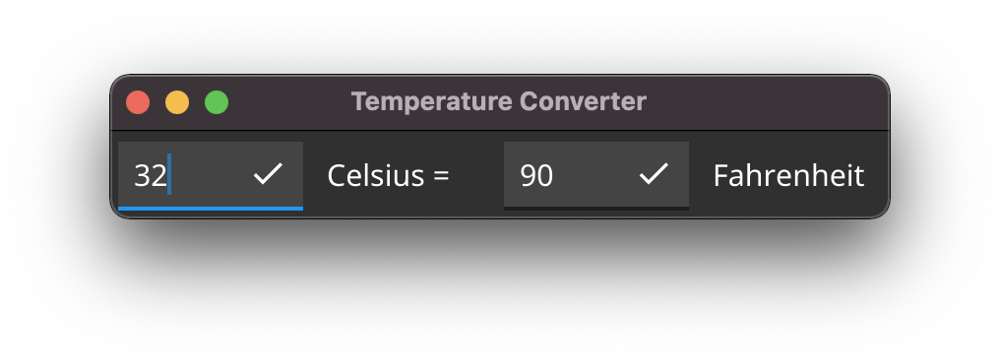

# 7GUIs using Go

An implementation of the [7 GUIs challenges](https://eugenkiss.github.io/7guis/)
using the [Gio](https://gioui.org/) / [Fyne](https://fyne.io) toolkit.

> Fyne implemention references [fyne-io/7guis](https://github.com/fyne-io/7guis) repository.

## Counter

Challenge: Understanding the basic ideas of a language/toolkit.

  
  

## Temperature Converter

Challenges: bidirectional data flow, user-provided text input.

  
  

